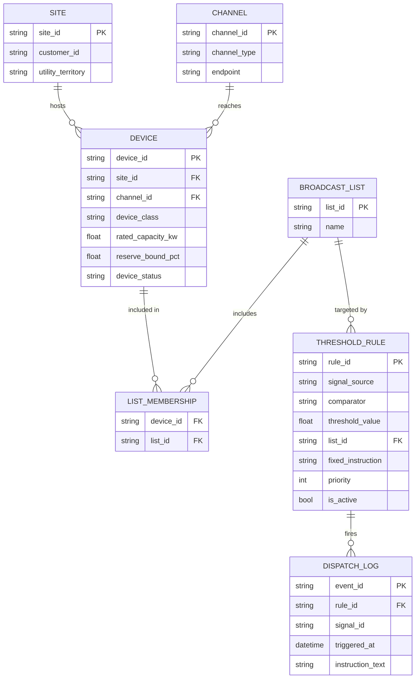

# L0 — Foundation Layer (v2, patched for L1 readiness)

Demand flexibility orchestration stack, built layer by layer, greenfield (no assumptions about any specific company's existing hardware or fleet).

## Purpose

L0 answers one question only: *which devices exist, and how do we reach them?* There is no decision problem here — no optimization, no state tracking beyond a firing log, no feedback loop. A single threshold rule fires a fixed instruction at a static list of devices. This layer is integration and data-modeling work, not control theory. It is necessary because every layer above it needs to know which devices exist and how to reach them, but it is not differentiated — anyone can build this in weeks.

This version (v2) patches three gaps that were found to be load-bearing for L1, not deferrable to it: duplicate-signal idempotency, rule priority/activation, and device reachability status. See "Known gaps" at the bottom for what was fixed here versus what remains genuinely deferred.

## Entities

### SITE
| Field | Type | Notes |
|---|---|---|
| site_id | string (PK) | |
| customer_id | string | |
| utility_territory | string | DISCOM / utility jurisdiction the site sits in |

### CHANNEL
| Field | Type | Notes |
|---|---|---|
| channel_id | string (PK) | |
| channel_type | string | e.g. `phone`, `sms`, `relay`, `api` — abstracted so the implementation can be swapped without changing the schema |
| endpoint | string | phone number, relay address, or (later) API endpoint |

### DEVICE
| Field | Type | Notes |
|---|---|---|
| device_id | string (PK) | |
| site_id | string (FK → SITE) | |
| channel_id | string (FK → CHANNEL) | |
| device_class | string | e.g. battery, thermostat |
| rated_capacity_kw | float | |
| reserve_bound_pct | float | Forward-compatible field. Not read by any L0 logic — enforced at L0 by firmware default or verbal agreement only. Exists now so L1's failsafe check and L2's slack calculation have a first-class field to reference. |
| device_status | string | **v2.** `active` / `paused` / `decommissioned`. Filters devices out of dispatch at the loop level. Deliberately distinct from L1's future per-event `dispatch_status` — reachability and delivery outcome are different concerns and must not share one enum. |

### BROADCAST_LIST
| Field | Type | Notes |
|---|---|---|
| list_id | string (PK) | |
| name | string | |

### LIST_MEMBERSHIP
| Field | Type | Notes |
|---|---|---|
| device_id | string (FK → DEVICE) | |
| list_id | string (FK → BROADCAST_LIST) | join table, many-to-many |

### THRESHOLD_RULE
| Field | Type | Notes |
|---|---|---|
| rule_id | string (PK) | |
| signal_source | string | e.g. `forecast_peak`, `discom_call` |
| comparator | string | `>`, `>=`, etc. |
| threshold_value | float | |
| list_id | string (FK → BROADCAST_LIST) | target list |
| fixed_instruction | string | the instruction text broadcast to every device on the list |
| priority | int | **v2.** Lower fires first. Resolves undefined ordering when two active rules match the same signal and overlap in target devices. |
| is_active | bool | **v2.** Allows a rule to be authored, tested, or retired without hard-deleting it (which would orphan its `DISPATCH_LOG` history via the foreign key). |

### DISPATCH_LOG
| Field | Type | Notes |
|---|---|---|
| event_id | string (PK) | |
| rule_id | string (FK → THRESHOLD_RULE) | |
| signal_id | string | **v2.** Dedup key. `(rule_id, signal_id)` should carry a unique index at the database level — the idempotency check in the loop is a convenience, not the actual guarantee against a race. |
| triggered_at | datetime | |
| instruction_text | string | audit record only — no per-device outcome, no ack |

## Relationships (ERD)



## Rule-evaluation loop

```
for signal in incoming_signals:
    matching_rules = ThresholdRule.where(signal_source == signal.source, is_active == true)
                                   .order_by(priority)
    for rule in matching_rules:
        if compare(signal.value, rule.comparator, rule.threshold_value):
            if DispatchLog.exists(rule_id=rule.id, signal_id=signal.id):
                continue  # already handled this signal for this rule — idempotency
            list = BroadcastList.get(rule.list_id)
            for device in list.devices:
                if device.device_status != 'active':
                    continue  # paused/decommissioned devices excluded from dispatch
                Channel.send(device.channel, rule.fixed_instruction)
            DispatchLog.create(rule_id=rule.id, signal_id=signal.id, triggered_at=now(),
                                instruction_text=rule.fixed_instruction)
```

## Forward-compatible design notes

- **`Channel.send(device.channel, instruction)`** has no return value the caller inspects at L0 — fire-and-forget. At L1, this same call site gains a return value (ack / nack / timeout) and `DEVICE` gains a live *per-event* status field. L1 does not replace this interface, it adds a return path to it.
- **`DEVICE.reserve_bound_pct`** is in the schema now specifically so L1's failsafe logic and L2's slack calculation (the actuarial guarantee constraint) have an existing, audited field to reference, rather than needing to be added retroactively under time pressure.
- **`DEVICE.device_status` vs. L1's future `dispatch_status`**: added in v2 specifically to pre-empt these two concerns being collapsed into one enum once L1 introduces its own per-event state machine (idle → dispatched → completed/failed). Reachability and delivery outcome must stay separate fields.
- **`(rule_id, signal_id)` uniqueness on `DISPATCH_LOG`**: added in v2 because L1 makes a duplicate dispatch materially worse — instead of one wasted duplicate instruction, it becomes two competing ack timers racing against the same device.

## Known gaps

### Resolved in v2 (fixed before L1, because L1 builds directly on these fields)
- Duplicate-signal idempotency — `signal_id` on `DISPATCH_LOG`, uniqueness enforced with `rule_id`.
- Undefined rule ordering on overlapping matches — `priority` and `is_active` on `THRESHOLD_RULE`.
- No device reachability check — `device_status` on `DEVICE`, kept distinct from L1's forthcoming per-event status.

### Deliberately still deferred (genuinely parallel to L1, not load-bearing for it)
- **Cooldown / hysteresis** on rule re-evaluation — lives entirely inside the rule-evaluation loop, which L1 doesn't touch (L1's changes are all downstream of dispatch, in the channel/device layer).
- **Effective window** (`effective_from` / `effective_until`) on `THRESHOLD_RULE` — an authoring/testing concern, orthogonal to whether a device acks.
- **`SIGNAL_LOG`** (a record of signals that *didn't* cross threshold) — pure audit trail; no other entity depends on it, and nothing in L1 reads it.

### Explicitly out of scope for L0 — correctly belongs to later layers
- Per-device delivery confirmation (did the instruction *land*) — L1's ack/nack path.
- Any capacity or state-of-charge awareness — L2's capability model; L0 doesn't need to know what a device can physically do, only that it exists and how to reach it.
- A structured, typed instruction schema instead of a plain string — only becomes necessary once `channel_type` is `api` and something needs to parse the instruction programmatically.
- A separate consent/opt-in entity — `LIST_MEMBERSHIP` already functions as the consent record at this scale.
