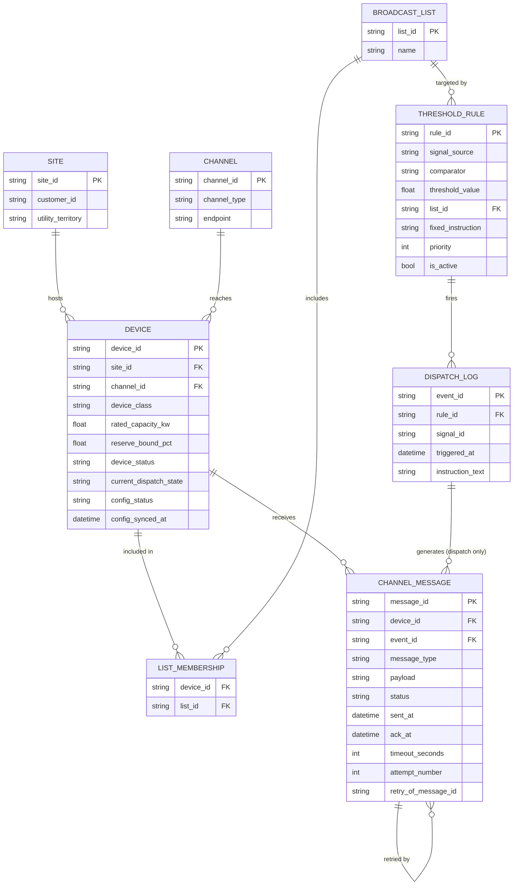

# L1 — Control Channel Layer (v2, patched)

Demand flexibility orchestration stack, built layer by layer, greenfield. Builds directly on `L0_foundation_model.md` (v2) — this document only covers what L1 adds or changes.

## Purpose

L0 answered *which devices exist and how do we reach them*. L1 answers two narrower questions: *did an instruction actually land*, and *does a device hold a safe fallback state even if the network never reaches it at all*. Mathematically L1 has nothing beyond L0's threshold rule — it's reliability infrastructure, not optimization.

Two independent flows exist at this layer:
1. **Dispatch flow** — triggered by a rule firing, with per-device delivery tracking and retry.
2. **Config sync flow** — pushes the failsafe reserve bound to a device and confirms it landed, independent of any dispatch event.

This v2 patches five gaps found on review: a race between the ack handler and the timeout watcher, no retry on either flow, no guard against overlapping concurrent dispatch to the same device, a missing terminal failure state for config sync, and an undefined default `config_status` at device creation.

## Entities

### Modified: DEVICE

`SITE`, `CHANNEL`, `BROADCAST_LIST`, `LIST_MEMBERSHIP`, and `THRESHOLD_RULE` are unchanged from L0 v2.

| Field | Type | Notes |
|---|---|---|
| current_dispatch_state | string | `idle` / `dispatched` / `completed` / `failed`. Denormalized cache of the latest `CHANNEL_MESSAGE` (dispatch type) for this device — source of truth remains `CHANNEL_MESSAGE`. |
| config_status | string | **v2: five states.** `unsynced` (default at creation — no config push has ever been attempted) / `pending` (a sync is currently in flight) / `synced` / `stale` (target `reserve_bound_pct` changed since last successful sync) / `failed` (retries exhausted, needs a human). The `unsynced`/`pending` split matters: without it, a freshly registered device and a device mid-sync were indistinguishable. |
| config_synced_at | datetime, nullable | Timestamp of the last successful config-sync ack. |

### Modified: CHANNEL_MESSAGE

| Field | Type | Notes |
|---|---|---|
| message_id | string (PK) | |
| device_id | string (FK → DEVICE) | |
| event_id | string (FK → DISPATCH_LOG), nullable | Set only for `dispatch_instruction` messages. |
| message_type | string | `dispatch_instruction` / `config_sync` |
| payload | string | |
| status | string | `pending` / `acked` / `nacked` / `timed_out` |
| sent_at | datetime | |
| ack_at | datetime, nullable | |
| timeout_seconds | int | |
| attempt_number | int | **v2.** 1 for the first attempt, incremented on each retry. |
| retry_of_message_id | string, self-referential FK, nullable | **v2.** Points to the original message if this row is a retry. Retries are modeled as new rows chained together, not as mutations of the original — this keeps full attempt history auditable instead of overwritten. |

## Relationships (ERD)



## Dispatch flow

```
MAX_DISPATCH_RETRIES = 2
MAX_CONFIG_RETRIES = 3

for signal in incoming_signals:
    matching_rules = ThresholdRule.where(signal_source == signal.source, is_active == true).order_by(priority)
    for rule in matching_rules:
        if compare(signal.value, rule.comparator, rule.threshold_value):
            if DispatchLog.exists(rule_id=rule.id, signal_id=signal.id):
                continue
            list = BroadcastList.get(rule.list_id)
            event = DispatchLog.create(rule_id=rule.id, signal_id=signal.id, triggered_at=now(),
                                        instruction_text=rule.fixed_instruction)
            for device in list.devices:
                if device.device_status != 'active':
                    continue
                if device.current_dispatch_state == 'dispatched':
                    continue  # already in-flight from another event; skip rather than double-dispatch
                send_dispatch_attempt(device, event, rule.fixed_instruction, attempt_number=1, retry_of=None)

def send_dispatch_attempt(device, event, instruction, attempt_number, retry_of):
    msg = ChannelMessage.create(device_id=device.id, event_id=event.id,
                                 message_type='dispatch_instruction', payload=instruction,
                                 status='pending', sent_at=now(), timeout_seconds=DEFAULT_ACK_TIMEOUT,
                                 attempt_number=attempt_number, retry_of_message_id=retry_of)
    device.current_dispatch_state = 'dispatched'
    device.save()
    Channel.send(device.channel, instruction, on_ack=lambda ok: handle_ack(msg.id, ok))

def handle_ack(message_id, success):
    msg = ChannelMessage.get(message_id)
    if msg.status != 'pending':
        return  # already resolved by the timeout watcher or a duplicate ack — race guard
    msg.status = 'acked' if success else 'nacked'
    msg.ack_at = now()
    msg.save()
    if success:
        msg.device.current_dispatch_state = 'completed'
        msg.device.save()
    else:
        retry_or_fail(msg)

def timeout_watcher():
    for msg in ChannelMessage.where(status='pending', sent_at < now() - msg.timeout_seconds):
        # conditional update — only claim messages still pending, same guard as handle_ack
        if not ChannelMessage.update_if_status(msg.id, expected='pending', new_status='timed_out'):
            continue  # ack landed between the query and this write; leave it alone
        retry_or_fail(msg)

def retry_or_fail(msg):
    if msg.message_type == 'dispatch_instruction' and msg.attempt_number <= MAX_DISPATCH_RETRIES:
        send_dispatch_attempt(msg.device, msg.event, msg.payload,
                               attempt_number=msg.attempt_number + 1, retry_of=msg.message_id)
    else:
        msg.device.current_dispatch_state = 'failed'
        msg.device.save()
```

## Config sync flow

```
def sync_reserve_bound(device, attempt_number=1, retry_of=None):
    msg = ChannelMessage.create(device_id=device.id, event_id=None, message_type='config_sync',
                                 payload=str(device.reserve_bound_pct), status='pending',
                                 sent_at=now(), timeout_seconds=CONFIG_SYNC_TIMEOUT,
                                 attempt_number=attempt_number, retry_of_message_id=retry_of)
    device.config_status = 'pending'
    device.save()
    Channel.send(device.channel, config_payload(device.reserve_bound_pct),
                  on_ack=lambda ok: handle_config_ack(device.id, msg.id, ok))

def handle_config_ack(device_id, message_id, success):
    msg = ChannelMessage.get(message_id)
    if msg.status != 'pending':
        return
    msg.status = 'acked' if success else 'nacked'
    msg.ack_at = now()
    msg.save()
    device = Device.get(device_id)
    if success:
        device.config_status = 'synced'
        device.config_synced_at = now()
        device.save()
    elif msg.attempt_number <= MAX_CONFIG_RETRIES:
        sync_reserve_bound(device, attempt_number=msg.attempt_number + 1, retry_of=msg.message_id)
    else:
        device.config_status = 'failed'  # exhausted retries — needs a human
        device.save()

def on_reserve_bound_changed(device):
    device.config_status = 'stale'
    device.save()
    sync_reserve_bound(device)

# on device registration — the previously-undefined default
def register_device(...):
    device = Device.create(..., device_status='active', current_dispatch_state='idle',
                            config_status='unsynced', config_synced_at=None)
    return device
```

## Design notes

- **Retries as a chain of rows, not a mutated counter.** `attempt_number` + `retry_of_message_id` preserve every individual attempt with its own timestamps, rather than overwriting a single row's history — important for later debugging "why did this device take three tries to dispatch."
- **The race guard is a status check, not a new field.** Both `handle_ack` and `timeout_watcher` only act on a message if it's still `pending`; no optimistic-lock version field was needed because `status` itself is a sufficient guard given the valid state transitions.
- **The overlap check is a single condition, not a new concept.** `current_dispatch_state == 'dispatched'` already existed; it just wasn't being read before fan-out. No new field required.
- **Why retry lives at L1 and reallocation doesn't.** Resending the same instruction to the same device is still reliability infrastructure — L1's theme. Deciding to substitute a *different* device when retries are exhausted requires the fleet-level capability model, which belongs to L2.

## Known gaps

### Resolved in v2
- Race between ack handler and timeout watcher — status-guarded conditional updates on both paths.
- No retry on either flow — `attempt_number`/`retry_of_message_id` chain, `MAX_DISPATCH_RETRIES`/`MAX_CONFIG_RETRIES`.
- Overlapping concurrent dispatch to the same device — `current_dispatch_state == 'dispatched'` check added to the fan-out loop.
- No terminal failure state for config sync — `failed` added as a fifth `config_status` value.
- Undefined default `config_status` at device creation — `unsynced` set explicitly in `register_device`.

### Deliberately deferred, not L1's responsibility
- Smart substitution when a device keeps failing — needs L2's fleet-level capability model.
- Aggregate failure detection across many devices on one channel — an L3-shaped pattern-detection problem, not a single-message concern.
- Ack authenticity/security — out of scope for this modeling exercise, the same way a consent entity was out of scope for L0.
