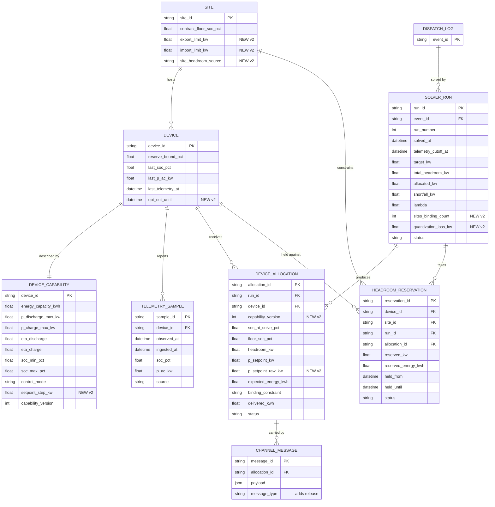

# L2 — Capability & Allocation Layer (v2, patched after completeness pass)

Builds directly on `L0_foundation_model.md` (v2) and `L1_control_channel_model.md` (v2, **requires v3 patch — see below**). This document only covers what L2 adds or changes.

## Purpose

L0 answered *which devices exist and how do we reach them*. L1 answered *did the instruction land, and does the failsafe bound hold even when nothing reaches the device*. L2 answers two questions neither layer could ask: *how much can each device actually give right now*, and *how should a fleet-level target be split across devices without breaching any single customer's guarantee or any single site's physical export limit*.

The qualitative change is that the instruction stops being a fixed string. At L0/L1 a rule fires `fixed_instruction` at every device on a list, identically. At L2 the rule fires a **fleet target** (kW for a duration) and a solver turns it into a **per-device setpoint**. This is the first layer with a decision problem in it — a small one, deliberately — and the first layer that reads telemetry. It is also the layer where `reserve_bound_pct` and the customer guarantee stop being a synced number on the device and become a live constraint the orchestrator enforces before it sends anything.

Two things L2 is *not*: it is not forecasting (SoC is observed at dispatch time, not predicted), and it is not multi-period. The allocation is a single-interval solve. Both are L3's job and are kept out on purpose — see "What's deliberately absent".

### Changes in v2

The v1 completeness pass surfaced six gaps. All six are patched here rather than deferred, because each one either changes the *shape* of the optimisation (and so would force re-derivation later) or produces a silently wrong number rather than a rough edge:

1. **Site layer added** — `SITE.export_limit_kw` / `import_limit_kw` and a second constraint family in the QP. Load-bearing: without it the model cannot express a site export cap, and adding it later means re-deriving the KKT conditions.
2. **Headroom reservation added** — `HEADROOM_RESERVATION` entity. Without it, two overlapping events allocate the same kWh twice and both under-deliver, each solve looking locally correct.
3. **`release` message type added** — an event can now be ended early and a setpoint withdrawn, not just left to expire.
4. **Setpoint quantization added** — `setpoint_step_kw` on capability, with a repair pass so rounding doesn't quietly lose the target.
5. **Per-event opt-out added** — `DEVICE.opt_out_until`, distinct from enrolment.
6. **`capability_version` recorded on the allocation** — the audit trail can now say which physics model a setpoint was solved against.

---

## Three flows at this layer

1. **Telemetry ingest** — continuous, independent of any event. Writes `TELEMETRY_SAMPLE`, refreshes the cache on `DEVICE`. Without this, L2 has no state to allocate against.
2. **Allocation flow** — triggered by a rule firing (same trigger as L0/L1). Builds the eligible set, computes per-device slack net of reservations, solves, writes `SOLVER_RUN` + `DEVICE_ALLOCATION` + `HEADROOM_RESERVATION`, hands each allocation to L1's channel as a structured payload.
3. **Re-allocation on failure** — triggered by L1's terminal `nacked` / `timed_out`. Closes the gap L1 explicitly deferred ("smart substitution when a device keeps failing").

Plus one closing step: **event release** at `t₀ + Δ` (or early), which withdraws setpoints and frees reservations.

---

## What's new relative to L1

### Modified entity: SITE

| Field | Type | Notes |
|---|---|---|
| contract_floor_soc_pct | float, nullable | **v1.** Contract-level SoC floor from the guaranteed-savings agreement. Deliberately separate from `DEVICE.reserve_bound_pct`: that is a *device* failsafe (backup/safety, synced to firmware at L1); this is a *commercial* promise about how much of the customer's battery the orchestrator may take. Same discipline as `device_status` vs `current_dispatch_state` — two concerns, two fields, never one enum. Null means no guarantee applies and the device floor governs alone. |
| export_limit_kw | float, nullable | **v2.** Maximum aggregate AC power the site may push toward the grid — net-metering sanction, single-phase inverter ceiling, or DISCOM condition. Null means unconstrained. This is the field that decides whether the dispatchable fleet at midday is large or approximately zero, and nothing above L2 can recover it if it's missing here. |
| import_limit_kw | float, nullable | **v2.** Sanctioned load. Binds the charge case the way `export_limit_kw` binds discharge. |
| site_headroom_source | string | **v2.** `measured` / `nameplate` / `assumed_default`. Records *how confident* the limit is. A fleet where most sites read `assumed_default` is a fleet whose total dispatchable capacity is an assumption, not a measurement — and this field is what makes that visible instead of letting a default propagate into a capacity number someone quotes externally. |

### Modified entity: DEVICE

| Field | Type | Notes |
|---|---|---|
| last_soc_pct | float, nullable | **v1.** Latest observed state of charge. |
| last_p_ac_kw | float, nullable | **v1.** Latest observed AC power. Sign convention: **positive = discharge to site/grid, negative = charge**. Used to dead-reckon SoC forward from `last_telemetry_at` to solve time. |
| last_telemetry_at | datetime, nullable | **v1.** Freshness anchor. A device staler than `TELEMETRY_STALE_AFTER` is excluded from the eligible set — the solver never allocates against a SoC it can't trust. |
| opt_out_until | datetime, nullable | **v2.** Per-event customer opt-out ("not tonight"). Distinct from `LIST_MEMBERSHIP` (enrolment — am I in the programme at all) and from `device_status = paused` (an operator action). L2 is the first layer where honouring this costs something real: headroom the solver would otherwise have counted. Checked in the eligibility filter. |

Source of truth for the three cache fields is `TELEMETRY_SAMPLE`; they are written only by the ingest path, never by the solver.

### Modified entity: THRESHOLD_RULE

| Field | Type | Notes |
|---|---|---|
| instruction_type | string | `fixed` / `fleet_target`. `fixed` preserves L0/L1 behaviour exactly (broadcast `fixed_instruction`, no solver). `fleet_target` routes through the allocation flow. Both coexist so existing rules keep working unchanged. |
| target_kw | float, nullable | Fleet-level target. **Positive = fleet discharge (peak shaving / DR call), negative = fleet charge (absorb surplus).** Required when `instruction_type = fleet_target`. |
| duration_min | int, nullable | Horizon Δ of the single-interval solve. Required for `fleet_target`. |

`fixed_instruction` is retained and becomes nullable (meaningful only for `fixed` rules).

### Modified entity: CHANNEL_MESSAGE (from L1)

| Field | Type | Notes |
|---|---|---|
| allocation_id | string (FK → DEVICE_ALLOCATION), nullable | Set for `dispatch_instruction`, `setpoint_revision`, and `release` messages from the allocation flow. Null for `config_sync` and for L1-style `fixed` dispatches. |
| payload | json | Was a plain string at L1. Now `{ "p_setpoint_kw": float, "duration_min": int, "expires_at": datetime }` for allocation-driven messages; still the raw string for `fixed` rules. This is where L0's noted "structured, typed instruction" gap actually becomes necessary — it wasn't, until a number had to be parsed. |

`message_type` gains two values beyond L1's `dispatch_instruction` / `config_sync`:

- **`setpoint_revision`** — replaces a live setpoint on a device that has already acked. Needed by re-allocation.
- **`release`** — **v2.** Withdraws a setpoint and returns the device to its own control. Sent at normal event end, and on early termination. Without it, the only way an event ends is `expires_at` lapsing, which means an operator cannot stop an event in progress and a device that missed its release stays at setpoint until expiry. Carries `{ "allocation_id": ..., "reason": "event_complete" | "event_cancelled" | "device_released" }`.

Both inherit L1's ack/nack/timeout machinery, retry chain, and status-guarded conditional updates unchanged. `release` uses a shorter retry budget (`MAX_RELEASE_RETRIES`) and, on terminal failure, relies on `expires_at` as the backstop — which is why `expires_at` stays in the payload even though `release` exists.

### New entity: DEVICE_CAPABILITY

One-to-one with `DEVICE`. Kept separate from `DEVICE` because `DEVICE` is L0's *registry* (identity + reachability) and this is a *physics model* — different owner, different change cadence, and L3 will derate it from observed behaviour without touching the registry row.

| Field | Type | Notes |
|---|---|---|
| device_id | string (PK, FK → DEVICE) | |
| energy_capacity_kwh | float | E_i — usable nameplate energy. |
| p_discharge_max_kw | float | P_i^dis,max. |
| p_charge_max_kw | float | P_i^chg,max. |
| eta_discharge | float | η_i^d ∈ (0,1]. |
| eta_charge | float | η_i^c ∈ (0,1]. |
| soc_min_pct | float | Physical/BMS floor. |
| soc_max_pct | float | Physical/BMS ceiling. |
| control_mode | string | `continuous` / `binary`. A device on an `api` channel taking a numeric setpoint is `continuous`. A device reachable only by relay, phone tree, or an on/off mode switch is `binary`: p_i ∈ {0, p̄_i} and nothing between. |
| setpoint_step_kw | float | **v2.** Quantization granularity the firmware actually accepts (e.g. 0.1 kW, or a % of rated). `0` means continuous. Ignoring this doesn't produce a rejected message — it produces a *silently rounded* one, so the fleet under- or over-delivers by an amount nobody logged. |
| capability_version | int | Bumped on any edit; recorded on both `SOLVER_RUN` and each `DEVICE_ALLOCATION`. |

`DEVICE.rated_capacity_kw` (L0) stays as the commercial nameplate figure. `DEVICE_CAPABILITY` carries the operational bounds the solver uses; the two are allowed to disagree.

### New entity: TELEMETRY_SAMPLE

Append-only. First entity in the stack written by something other than the orchestrator's own decisions.

| Field | Type | Notes |
|---|---|---|
| sample_id | string (PK) | |
| device_id | string (FK → DEVICE) | |
| observed_at | datetime | Device-side timestamp, not ingest time. The gap between the two is channel latency and is worth keeping visible. |
| ingested_at | datetime | |
| soc_pct | float | |
| p_ac_kw | float | Same sign convention as `DEVICE.last_p_ac_kw`. |
| source | string | `poll` / `push` / `manual`. |

Index on `(device_id, observed_at desc)`.

### New entity: HEADROOM_RESERVATION — **v2**

The fix for concurrent events double-counting the same kWh. A reservation is taken at solve time, *before* the message goes out, and is what makes the next solver run see reduced headroom even though the first event hasn't been acked yet.

| Field | Type | Notes |
|---|---|---|
| reservation_id | string (PK) | |
| device_id | string (FK → DEVICE) | |
| site_id | string (FK → SITE) | Denormalized from the device so the *site*-level reservation sum is a single indexed query, not a join per solve. |
| run_id | string (FK → SOLVER_RUN) | |
| allocation_id | string (FK → DEVICE_ALLOCATION), nullable | |
| reserved_kw | float | Signed, same convention as setpoints. |
| reserved_energy_kwh | float | reserved_kw · Δ / η — what this hold removes from the device's slack, distinct from what it removes from its power headroom. Both matter: a second event overlapping by one minute costs almost no energy but all of the power. |
| held_from | datetime | |
| held_until | datetime | Hard expiry, set to `expires_at` of the dispatch. A reservation can never outlive the event it belongs to, so a crashed release path leaks headroom for at most one event duration. |
| status | string | `held` / `committed` / `released`. `held` on solve; → `committed` on ack; → `released` on nack, timeout, release, or expiry. Both `held` and `committed` count against available headroom; only `released` frees it. |

Index on `(device_id, status, held_until)` and `(site_id, status, held_until)`.

**Why `held` counts against headroom.** The alternative — counting only acked allocations — means a second event solving during the first event's ack window sees full headroom and allocates the same energy again. Reserving pessimistically at solve time and releasing on failure is the correct asymmetry: over-reserving briefly costs a little unused capacity, under-reserving costs a missed delivery on both events.

### New entity: SOLVER_RUN

One row per solve. A single `DISPATCH_LOG` event can have several — the initial allocation plus each re-allocation.

| Field | Type | Notes |
|---|---|---|
| run_id | string (PK) | |
| event_id | string (FK → DISPATCH_LOG) | |
| run_number | int | 1 for the initial solve, 2+ for re-allocations. |
| solved_at | datetime | |
| telemetry_cutoff_at | datetime | Only samples with `observed_at ≤` this were used. Makes the solve reproducible. |
| target_kw | float | R for this run (residual on re-allocations). |
| eligible_count | int | |
| total_headroom_kw | float | Σ p̄_i over the eligible set, net of reservations — known *before* solving. |
| allocated_kw | float | Σ p_i after solving and quantization. |
| shortfall_kw | float | s = R − Σ p_i. Non-zero only when the fleet physically can't meet the target. |
| lambda | float | Multiplier on the fleet constraint at the optimum — the internal marginal value of one more kW. Stored because L4 compares it against a market price. |
| sites_binding_count | int | **v2.** How many sites hit their export/import limit (μ_k > 0). If this is most of the fleet, the constraint on the business is site interconnection, not batteries. |
| quantization_loss_kw | float | **v2.** Σp_i before rounding minus after. Should be near zero after the repair pass; a persistent non-zero value means step sizes are coarse relative to typical setpoints. |
| status | string | `optimal` / `degraded` (feasible with shortfall) / `no_eligible_devices` / `error`. |

### New entity: DEVICE_ALLOCATION

Per-device output of one solver run. This is what the channel actually sends.

| Field | Type | Notes |
|---|---|---|
| allocation_id | string (PK) | |
| run_id | string (FK → SOLVER_RUN) | |
| device_id | string (FK → DEVICE) | |
| capability_version | int | **v2.** Which `DEVICE_CAPABILITY` version this setpoint was solved against. Recorded per allocation, not just per run, because a capability edit mid-event would otherwise make an allocation un-reproducible. |
| soc_at_solve_pct | float | SoC the solver believed after dead-reckoning. Audit: "what did we think we knew". |
| floor_soc_pct | float | Effective floor used: max(physical, failsafe, contract). Audit: "which constraint bound this device". |
| headroom_kw | float | p̄_i, net of existing reservations. |
| p_setpoint_kw | float | p_i — the quantized number actually sent. |
| p_setpoint_raw_kw | float | **v2.** Pre-quantization value, kept so quantization error is measurable rather than inferred. |
| expected_energy_kwh | float | p_i · Δ / η_i^d. |
| binding_constraint | string | `power` / `energy` / `site` / `none`. **v2 adds `site`.** Whether p̄_i was capped by the inverter, the guarantee slack, or the site export limit. Fleet-wide this is a strategy signal, not just audit — see design notes. |
| delivered_kwh | float, nullable | Filled post-event by integrating `TELEMETRY_SAMPLE.p_ac_kw` over the window. Plain measurement, no baseline model — see gaps. |
| status | string | `pending` / `sent` / `confirmed` / `failed` / `superseded` / `released`. |

Unique index on `(run_id, device_id)`.

---

## Relationships (ERD, L2 additions only — L0/L1 relationships unchanged)



---

## The allocation problem

Notation for one event with fleet target R > 0 (discharge case; charge is symmetric, given below) and horizon Δ hours. Sites indexed by k, devices by i, with k(i) the site of device i.

### Eligible set

Device i ∈ 𝒟 iff all of:

- `device_status = active` (L0)
- `config_status = synced` (L1 — the failsafe bound is confirmed live on the device)
- no in-flight `CHANNEL_MESSAGE` for the device (L1 v3 guard — see interface change)
- `opt_out_until` is null or in the past **(v2)**
- `now − last_telemetry_at ≤ TELEMETRY_STALE_AFTER`
- `DEVICE_CAPABILITY` row exists

### Effective floor

    floor_i = max( soc_min_i ,  reserve_bound_i ,  contract_floor_site(i) )

This one line is the first live enforcement of the actuarial guarantee. The three terms are physics, failsafe, and contract; whichever binds is recorded per device.

### SoC at solve time

Dead-reckoned from the last sample so a 1–2 min telemetry lag doesn't systematically over-allocate:

    SoC_i(t₀) = clip( last_soc_i − (last_p_i · (t₀ − t_last)) / (η_i^d · E_i) ,  soc_min_i ,  soc_max_i )

(charging-side efficiency when last_p_i < 0).

### Device headroom, net of reservations — **v2**

    A_i   = E_i · max(0, SoC_i(t₀) − floor_i)                       [kWh, DC]
    A_i'  = A_i − Σ (reserved_energy_kwh for i, status ∈ {held, committed})
    S_i   = η_i^d · max(0, A_i') / Δ                                 [kW, AC]
    R_i^p = Σ (reserved_kw for i, status ∈ {held, committed})
    p̄_i   = max( 0, min( P_i^dis,max − R_i^p ,  S_i ) )

Energy and power are reserved separately because they deplete differently: a second event overlapping by one minute costs almost none of the device's energy slack but all of its power headroom for that minute.

`binding_constraint = power` if the inverter term binds, `energy` if the slack term does.

### Site headroom — **v2**

    G_k = max( 0, export_limit_k − Σ (reserved_kw at site k, status ∈ {held, committed}) )

with `G_k = +∞` when `export_limit_kw` is null.

### The QP

    minimise_{p, s}    ½ Σ_i c_i p_i²  +  M · s

    subject to         Σ_i p_i + s = R                          (λ)
                       Σ_{i : k(i)=k} p_i ≤ G_k      ∀ k         (μ_k ≥ 0)
                       0 ≤ p_i ≤ p̄_i                ∀ i ∈ 𝒟
                       s ≥ 0

- s is shortfall slack; M a large penalty so s > 0 only when the target is physically infeasible.
- c_i > 0 is a per-device cost weight. Default at L2 is **c_i = 1/p̄_i**, the *equal-stress* allocation: every device ends at the same fraction of its own available slack, so no customer is asked for a larger share of what they can give than any other. Cycle-cost or contract-priority weightings plug into the same slot without changing structure.

**Why a QP and not an LP.** A linear objective drains the cheapest device to its floor before touching the next — maximally uneven cycling and the worst exposure if a single device fails. The quadratic term spreads load and makes the problem strictly convex, so the solution is unique and the duals are well-behaved.

### KKT and the solve — **restated for v2**

Stationarity with both multipliers:

    c_i p_i − λ + μ_{k(i)} = 0    ⇒    p_i(λ, μ_k) = clip( (λ − μ_k) / c_i ,  0 ,  p̄_i )
    s > 0  ⇒  λ = M
    complementarity:  μ_k · ( Σ_{i∈k} p_i − G_k ) = 0,   μ_k ≥ 0

The structure that made v1 cheap survives, one level deeper:

- **Given λ, sites are independent.** Each site solves for its own μ_k. Σ_{i∈k} p_i is non-increasing in μ_k, so μ_k is a 1-D bisection on [0, λ]: if the site sum at μ_k = 0 already satisfies G_k then μ_k = 0 and the site is unconstrained; otherwise bisect to the μ_k where the site sits exactly at G_k.
- **Given the inner solve, Σ_i p_i is still monotone non-decreasing in λ.** So λ* is an outer bisection on [0, M].

Cost is therefore an outer bisection wrapping a per-site inner bisection — still no solver library, still no matrix factorisation.

**The residential shortcut.** For a site with exactly one eligible device, the site constraint is just another box bound: fold it in as

    p̄_i ← min( p̄_i, G_{k(i)} )

and drop μ_k entirely. In a residential fleet nearly every site is single-device, so the inner loop runs only for the handful of multi-device sites, and for a wholly single-device fleet the problem collapses back to v1's closed form:

    p_i = p̄_i · min(1, λ),      λ* = R / Σ_i p̄_i

one division. The site layer costs nothing in the common case and is *correct* in the uncommon one — which is the reason to add it now rather than discover it later.

**Interpretation of the duals.** λ* is the marginal internal value of one more kW of fleet headroom at this instant — exactly what L4 needs to compare against a DISCOM DF price or a wholesale spread. μ_k is the marginal value of one more kW of *export capacity at site k*: a directly readable, per-site answer to "what is this site's interconnection limit costing us." L2 uses neither for anything beyond the solve; it just refuses to throw them away.

### Quantization and repair — **v2**

Firmware accepts discrete setpoints. Rounding after the solve loses target silently, so:

```
q_i = setpoint_step_kw_i
p_i_floor = floor(p_i / q_i) * q_i                       # never exceeds a bound
deficit   = Σ_i (p_i - p_i_floor)                        # ≥ 0, < Σ q_i
# distribute whole quanta by largest fractional remainder, respecting every bound
for i in devices sorted by (p_i - p_i_floor) desc:
    if deficit < q_i: break
    if p_i_floor + q_i <= p̄_i and site_sum(k(i)) + q_i <= G_k:
        p_i_floor += q_i;  deficit -= q_i
```

Flooring first guarantees no bound is ever violated by rounding — the repair pass only adds back quanta that fit. Residual `deficit` is recorded as `quantization_loss_kw`; `p_setpoint_raw_kw` keeps the pre-rounding value so the error is measured, not inferred.

### Binary devices

For i with `control_mode = binary`, p_i ∈ {0, p̄_i}. L2 uses greedy rounding after the continuous solve: binary devices with continuous p_i ≥ ½ p̄_i go to p̄_i, others to 0, then continuous devices re-solve on the residual. A heuristic, not an exact MIQP — recorded as a known gap.

### Charge case (R < 0)

Replace floor with ceiling, discharge limit with charge limit, η^d with 1/η^c, and `export_limit_kw` with `import_limit_kw`:

    A_i = E_i · max(0, soc_max_i − SoC_i(t₀)),   S_i = A_i / (η_i^c · Δ),   p̄_i = min(P_i^chg,max, S_i)

Solve for |R|; restore sign on the setpoint. An event is one-sided by construction — a single rule never asks some devices to charge and others to discharge.

---

## Allocation flow (pseudocode)

```
on rule fire (event, rule) where rule.instruction_type == 'fleet_target':
    R, Δ = rule.target_kw, rule.duration_min / 60
    t0   = now();  expires_at = t0 + Δ

    eligible = devices on rule.list where
                 device_status == 'active'
             and config_status == 'synced'
             and not ChannelMessage.in_flight(device)
             and (opt_out_until is null or opt_out_until <= t0)
             and (t0 - last_telemetry_at) <= TELEMETRY_STALE_AFTER
             and DeviceCapability.exists(device)

    with transaction:                          # reservations must be atomic vs. a concurrent solve
        for i in eligible:
            cap    = DeviceCapability.get(i)
            floor  = max(cap.soc_min_pct, i.reserve_bound_pct,
                         i.site.contract_floor_soc_pct or 0)
            soc    = dead_reckon(i.last_soc_pct, i.last_p_ac_kw, t0 - i.last_telemetry_at, cap)
            A      = cap.energy_capacity_kwh * max(0, soc - floor) / 100
            A     -= Reservation.energy_held(i)
            S      = cap.eta_discharge * max(0, A) / Δ
            pbar_i = max(0, min(cap.p_discharge_max_kw - Reservation.power_held(i), S))
            c_i    = 1 / pbar_i if pbar_i > 0 else +inf

        for k in sites(eligible):
            G_k = max(0, (k.export_limit_kw or +inf) - Reservation.power_held_at_site(k))
            if k has exactly one eligible device i:                  # residential shortcut
                pbar_i = min(pbar_i, G_k)

        p, s, λ, μ = solve_qp(R, pbar, c, G)   # outer bisection on λ, inner bisection on μ_k
        p          = round_binary_devices(p, pbar, eligible)
        p, qloss   = quantize_and_repair(p, pbar, G, setpoint_steps)

        run = SolverRun.create(event_id=event.id, run_number=1, target_kw=R,
                               total_headroom_kw=Σpbar, allocated_kw=Σp, shortfall_kw=s,
                               lambda=λ, sites_binding_count=|{k : μ_k > 0}|,
                               quantization_loss_kw=qloss,
                               status='optimal' if s == 0 else 'degraded')

        for i in eligible where p_i > EPS_KW:
            alloc = DeviceAllocation.create(run_id=run.id, device_id=i, p_setpoint_kw=p_i,
                                            capability_version=cap_i.capability_version, ...)
            Reservation.create(device_id=i, site_id=k(i), run_id=run.id,
                               allocation_id=alloc.id, reserved_kw=p_i,
                               reserved_energy_kwh=p_i*Δ/cap_i.eta_discharge,
                               held_from=t0, held_until=expires_at, status='held')
    # end transaction — reservations visible to any concurrent solve from here

    for alloc in run.allocations:
        ChannelMessage.send(alloc.device, type='dispatch_instruction', allocation_id=alloc.id,
                            payload={p_setpoint_kw: alloc.p_setpoint_kw,
                                     duration_min: rule.duration_min, expires_at: expires_at})
```

Reservations are written **inside the same transaction as the solve** and before any message goes out. That ordering is the whole point: a concurrent solve starting a millisecond later sees the reduced headroom.

## Re-allocation on failure

Triggered when L1's retry chain reaches terminal `nacked` / `timed_out` for an allocation-driven message.

```
on terminal_failure(message) where message.allocation_id is not null:
    alloc = DeviceAllocation.get(message.allocation_id)
    alloc.status = 'failed'
    Reservation.release(alloc.id)                      # free the headroom immediately
    run = alloc.run; event = run.event
    if run.run_number >= MAX_REALLOCATIONS: return     # event stays 'degraded'

    committed = Σ p_j over allocations in event with status ∈ {'sent', 'confirmed'}
    R'        = event.rule.target_kw - committed
    if R' <= EPS_KW: return

    candidates = (eligible devices with no allocation in this event)
               ∪ (devices with status ∈ {'sent','confirmed'} and remaining headroom > EPS_KW)

    solve as above with target R' over candidates → SolverRun(run_number = run.run_number + 1)
    for each new allocation:
        if device already has a live allocation in this event:
            ChannelMessage.send(type='setpoint_revision',
                                payload={p_setpoint_kw: p_old + p_new, expires_at: expires_at})
            mark old allocation 'superseded'           # reservation transfers, not released
        else:
            ChannelMessage.send(type='dispatch_instruction', ...)
```

**`committed` counts `sent`, not only `confirmed` — v2.** A sent-but-unacked allocation may still land. Treating it as uncommitted would re-allocate the same kW to another device, and if the first then acks, the fleet overshoots. Same asymmetry as the reservation model: assume an outstanding message will succeed until L1 says terminally otherwise.

Bounded by `MAX_REALLOCATIONS` so a flapping device cannot keep the event re-solving indefinitely.

## Event release — **v2**

```
on event_end(event, reason) at expires_at, or on operator cancel:
    for alloc in event.live_allocations:
        ChannelMessage.send(alloc.device, type='release', allocation_id=alloc.id,
                            payload={reason: reason})
        alloc.status = 'released'
    Reservation.release_all(event)

on reservation_expiry_sweep():                          # backstop, runs on a timer
    Reservation.where(status != 'released', held_until < now()).release()
```

The sweep exists because a crashed release path must not leak headroom permanently. `held_until` bounds the leak to one event duration even if every other path fails.

## Post-event settlement (measurement only)

At `t₀ + Δ`, for each allocation that reached `confirmed`:

    delivered_kwh = ∫_{t₀}^{t₀+Δ} p_ac(t) dt      (trapezoidal over TELEMETRY_SAMPLE)

written to `DEVICE_ALLOCATION.delivered_kwh`. This is a measurement, not a verification: it says what the device did, not what it would have done otherwise. Baseline-relative M&V is L3.

---

## L1 patch required (v3) — apply before L2 goes live

L1 v2's fan-out guard was `current_dispatch_state == 'dispatched' → skip`. That blocks any second message to a device mid-event, which is exactly what `setpoint_revision` and `release` need to do. The guard must be restated as **"no in-flight message"** — no `CHANNEL_MESSAGE` for the device in `pending` — which is the property L1 actually cared about (one handshake at a time per device) without forbidding a revision or release to a device that has already acked.

L1's status-guarded conditional updates, retry chain, and timeout watcher apply to `setpoint_revision` and `release` unchanged; `release` gets its own retry budget. This is an L1 change, not an L2 addition, and is tracked as such.

---

## Forward-compatible design notes

- **`SOLVER_RUN.lambda`** is stored for L4. At L2 it is an audit number; at L4 it is the internal price compared against a market price, and the single-interval QP becomes one stage of a receding-horizon problem where λ becomes a trajectory.
- **`μ_k` is deliberately not persisted per site at L2** — only `sites_binding_count`. When L3 makes site limits time-varying (dynamic operating envelopes), μ_k becomes a trajectory worth storing per site per interval, and gets its own table then rather than a column now.
- **`floor_i` is deterministic at L2.** L3 replaces `contract_floor_soc_pct` with a time-varying, forecast-driven floor (the energy the customer's own evening load will need), and the hard bound becomes a chance constraint P(SoC_i(t+Δ) ≥ floor_i) ≥ 1−ε. The plug point is the single line computing `floor_i`; nothing else changes shape.
- **`export_limit_kw` is a scalar at L2, an envelope at L3.** Dynamic operating envelopes make G_k a function of time and DISCOM state. The constraint row is already in the QP; L3 only changes what fills it.
- **Single interval → multi-period.** The state update SoC_i(t+Δ) = SoC_i(t) − p_i Δ / (η_i^d E_i) is already implied by the slack calculation. L3/L4 write it out over a horizon and add coupling across intervals; the per-interval block is exactly L2's QP.
- **`HEADROOM_RESERVATION` is the seam for L3 scheduling.** At L2 a reservation is taken at solve time for one event. At L3, reserving headroom *ahead* of a forecast peak is the same entity with `held_from` in the future — no new table.
- **`capability_version`** exists so L3 can derate devices from observed `delivered_kwh` vs `expected_energy_kwh` without editing history.
- **`c_i` is a slot.** Equal-stress at L2; degradation cost, contract priority, or a learned reliability weight later, same structure.
- **`binding_constraint` fleet-wide is a strategy signal, not just audit.** Mostly `power` → inverter-limited, more battery kWh won't help. Mostly `energy` → the guarantee floor is capping the resource, which is a pricing and contract question. Mostly `site` → interconnection is the binding constraint on the whole business, and no amount of hardware or software at the device level changes it.
- **`site_headroom_source`** exists so a fleet-wide capacity figure can always be decomposed into measured vs. assumed. A capacity number quoted externally should never rest silently on `assumed_default`.

## What's deliberately absent

- **No forecasts of any kind.** SoC is observed (plus a linear dead-reckon); no load, solar, or price forecast. Adding any here would be pre-building L3.
- **No multi-period optimisation.** One interval, one solve. Sequencing across intervals, pre-charging ahead of a known peak, and reserving headroom for *later* events are receding-horizon concerns — note the reservation *entity* exists, but nothing at L2 creates a forward-dated one.
- **No baseline / M&V model.** `delivered_kwh` is measured, not compared against a counterfactual.
- **No price or market signal.** R comes from the rule, not a bid. The trigger is still L0's threshold rule; only its output changed shape.
- **No learning.** Capability parameters are entered, not inferred.
- **No cross-site coordination beyond the per-site cap.** Feeder- or transformer-level constraints (many sites sharing one asset) need a topology model L2 doesn't have. `SITE` is the coarsest spatial unit here.

## Known gaps

### Resolved in v2 (fixed before L3, because L3 builds directly on these)
- **Missing site layer** — `export_limit_kw` / `import_limit_kw`, G_k constraint family, μ_k duals, `binding_constraint = site`.
- **Concurrent events double-counting headroom** — `HEADROOM_RESERVATION`, reserved inside the solve transaction, released on failure or expiry.
- **No way to end an event early** — `release` message type, plus the expiry sweep as backstop.
- **Silent setpoint rounding** — `setpoint_step_kw`, floor-then-repair pass, `quantization_loss_kw` and `p_setpoint_raw_kw` recorded.
- **No per-event customer opt-out** — `DEVICE.opt_out_until`, checked in the eligibility filter.
- **Un-reproducible allocations after a capability edit** — `capability_version` recorded per allocation.
- **Re-allocation could overshoot** — `committed` now counts `sent` as well as `confirmed`.

### Genuinely L2's, deliberately left open
- **Binary devices are handled by greedy rounding**, not an exact solve. Acceptable while binary devices are a small share of the fleet. If field verification shows the fleet is mostly binary (no server-side numeric setpoint), this stops being a corner case and needs either a proper MIQP treatment or a policy that binary devices only sit on `fixed` rules. **Contingent on a field answer, not a design decision.**
- **Telemetry staleness is binary** (fresh or excluded). A confidence-weighted discount for moderately stale samples would keep more of the fleet eligible; deferred until the fleet offline rate is measured, since the right cutoff depends on the observed distribution.
- **Dead-reckoning assumes constant power since the last sample.** Fine at 1–2 min lag, wrong at 20 min. The staleness cutoff bounds the error; the assumption is stated here rather than buried in the solver.

### Deferred — belongs to L3
- Forecast-driven, time-varying floor (the actual customer-load protection behind the guarantee).
- Chance-constrained version of the floor.
- Time-varying site envelopes and per-site μ_k trajectories.
- Forward-dated headroom reservations (reserving for a predicted peak).
- Baseline-relative measurement & verification.
- Capability derating from observed performance.
- Aggregate failure-pattern detection (deferred from L1; still L3).

### Deferred — belongs to L4
- Using λ against an external price.
- Multi-period / receding-horizon allocation.
- Bidding, market registration, settlement.

### Out of scope for this stack
- Feeder/transformer topology above the site.
- Ack authenticity and message security — same class of exclusion as L0's consent entity.
